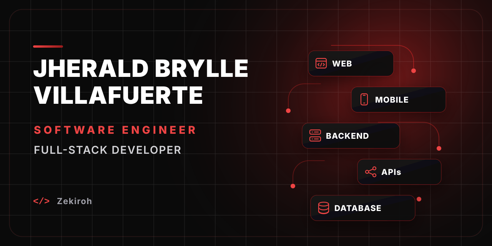

 
 

---

## Technology Stack

<table width="100%">
<tr>
<td width="50%" align="center" valign="top">

<h3 align="center">Frontend</h3>

</td>
<td width="50%" align="center" valign="top">

<h3 align="center">Database</h3>

</td>
</tr>

<tr>
<td width="50%" align="center" valign="top">

<h3 align="center">Backend</h3>

</td>
<td width="50%" align="center" valign="top">

<h3 align="center">Delivery</h3>

</td>
</tr>

<tr>
<td colspan="2" align="center" valign="top">

<h3 align="center">Mobile</h3>

</td>
</tr>
</table>

---

## GitHub Analytics

 
 

 
 

---

## Connect With Me

